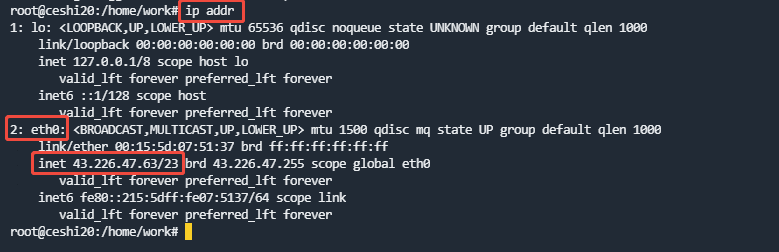
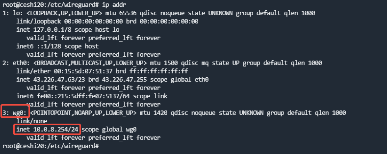

### WireGuard 组网

- 环境： Ubuntu 20.04.5 LTS

#### 安装服务端

- 注意 如果不是root用户需要加sudo
- 先更新

```shell
sudo apt update
```

- 进行安装

```shell
sudo apt install wireguard
```

- 创建一个工作目录

```shell
mkdir /etc/wireguard/
cd /etc/wireguard/
```

- 开启IP转发

```shell
echo "net.ipv4.ip_forward = 1" >> /etc/sysctl.conf
sysctl -p
```

- 生成秘钥

```shell
umask 077
# 生成服务器密钥
wg genkey | tee server_privatekey | wg pubkey > server_publickey

# 生成客户端密钥（可生成多个）
wg genkey | tee client1_privatekey | wg pubkey > client1_publickey
```

- 配制 wireguard
-



```shell
cat > wg0.conf <<EOF
[Interface]
PrivateKey = $(cat server_privatekey) # 填写本机的 privatekey 内容
Address = 10.0.8.254/24 # 服务端地址 可自由规划
ListenPort = 50814 # 注意该端口为UDP端口
DNS = 8.8.8.8 # 可读配制
MTU = 1420

# 流量转发规则（eth0需替换）
PostUp = iptables -A FORWARD -i wg0 -j ACCEPT; iptables -t nat -A POSTROUTING -o eth0 -j MASQUERADE
PostDown = iptables -D FORWARD -i wg0 -j ACCEPT; iptables -t nat -D POSTROUTING -o eth0 -j MASQUERADE

[Peer]
# 客户端1配置
PublicKey = $(cat client1_publickey) # 填写对端的 publickey 内容
AllowedIPs = 10.0.8.10/24
EOF
```

- 启动服务

```shell
# 设置开机自启
systemctl enable wg-quick@wg0

# 启动服务
wg-quick up wg0

# 检查状态
wg show
```



#### 安装客户端

- 生成客户端配制

```shell
# 生成客户端配置
cat > client1.conf <<EOF
[Interface]
PrivateKey = $(cat client1_privatekey)
Address = 10.0.8.10/32
DNS = 8.8.8.8
MTU = 1420

[Peer]
PublicKey = $(cat server_publickey)
Endpoint = [服务器公网IP]:50814
AllowedIPs = 0.0.0.0/0
PersistentKeepalive = 25
EOF
```

#### 多客户端配置

```shell
# 生成新客户端密钥
wg genkey | tee client2_privatekey | wg pubkey > client2_publickey

# 追加到wg0.conf
cat >> wg0.conf <<EOF

[Peer]
# 客户端2配置
PublicKey = $(cat client2_publickey)
AllowedIPs = 10.0.8.11/32
EOF

# 重载配置
wg syncconf wg0 <(wg-quick strip wg0)
```

#### 配制使用

- windows

```shell
官网下载客户端,导入client1.conf配置
```

- linux

```shell
# 安装客户端
apt install wireguard

# 使用配置
wg-quick up ./client1.conf
```

#### 关键注意事项：

- 防火墙需放行UDP 50814端口
- eth0需替换为服务器实际公网网卡名
- 每个客户端应有独立的IP地址
- MTU值可根据网络情况调整（默认1420）
- 配置文件需妥善保管，PrivateKey不可泄露

#### 常用命令：

- 查看连接状态：wg show
- 临时关闭服务：wg-quick down wg0
- 查看运行日志：journalctl -u wg-quick@wg0 -f
```shell
# peer 添加客户端公钥 allowed-ips 用于添加互联ip以及网段
wg set wg0 peer [客户端公钥] allowed-ips 10.0.8.11/32

# 移除客户端
sudo wg set wg0 peer [客户端公钥] remove

echo '
[Peer]
# 这是新客户端的公钥
PublicKey = [客户端公钥]
# 这是为新客户端分配的IP
AllowedIPs = 10.0.0.11/32
' | sudo tee /new_peer.conf

# 添加配置
sudo wg addconf wg0 new_peer.conf

# 将当前运行配置保存 
# wg0为wireguard接口
wg-quick save wg0
```
